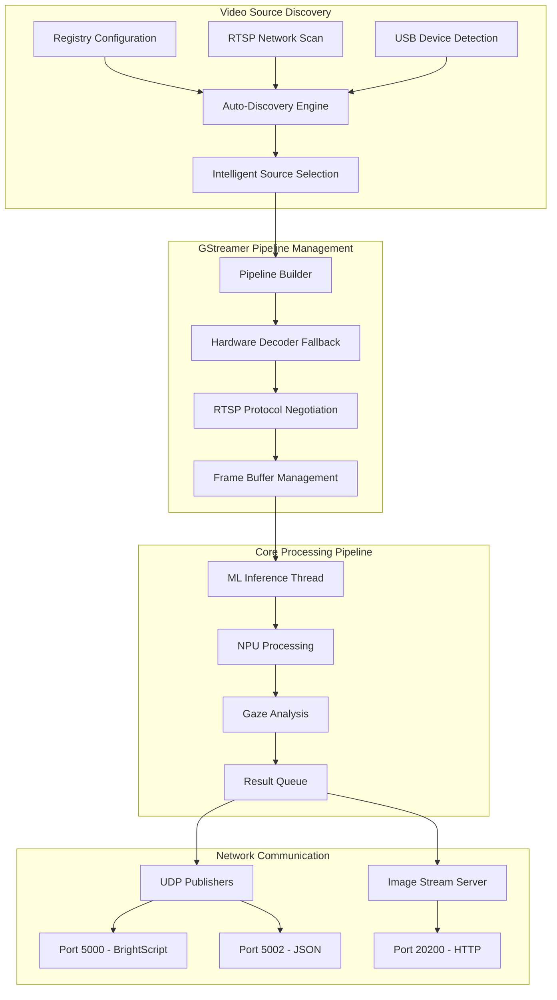
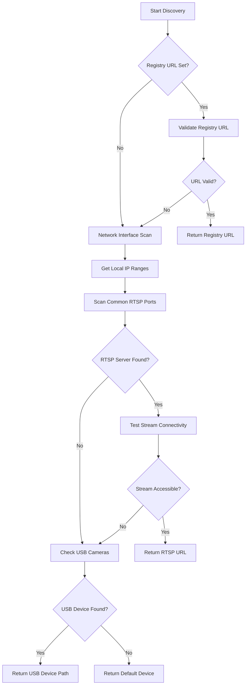
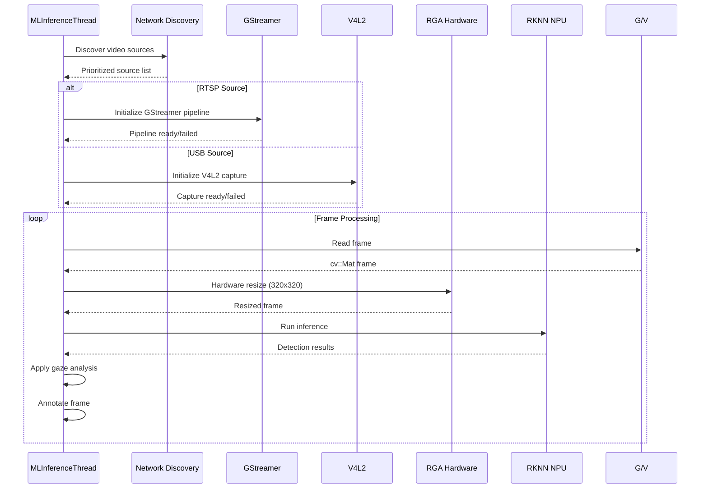

# BrightSign NPU Gaze Detection Extension - RTSP Streaming Design

## Overview

The BrightSign NPU Gaze Detection Extension has been enhanced with comprehensive RTSP streaming capabilities, enabling remote video source ingestion for digital signage deployments. This enhancement adds automatic network discovery, intelligent source selection, GStreamer pipeline management, and BrightSign registry integration while maintaining backward compatibility with USB cameras.

## Enhanced Architecture Overview

The RTSP-enabled system extends the original three-thread producer-consumer pattern with intelligent video source management:



## RTSP Video Source Management

### Automatic Source Discovery

The system implements a sophisticated source discovery mechanism through `detect_source_xt5.sh`:

#### Discovery Priority:
1. **Registry Configuration** (highest priority)
2. **Command Line Arguments**
3. **Auto-discovered RTSP streams**
4. **USB cameras**
5. **Default device** (lowest priority)

#### Registry Integration:
```bash
# Full RTSP URL
registry write extension bsext-gaze-rtsp-url rtsp://192.168.1.100:8554/stream

# RTSP server (auto-discovers streams)
registry write extension bsext-gaze-rtsp-server 192.168.1.100:8554

# Disable auto-start
registry write extension bsext-gaze-disable-auto-start true
```

### Network Discovery Algorithm

The discovery engine implements BusyBox-compatible network scanning:



#### BusyBox Compatibility Features:
- Limited tool dependency (avoids `nc`, `curl`, `ping` when unavailable)
- Timeout-based connectivity testing
- Graceful fallback mechanisms
- Registry-based configuration persistence

### GStreamer Pipeline Architecture

The system uses multiple fallback pipelines for maximum compatibility:

#### Pipeline Hierarchy:

1. **Hardware-Accelerated Pipeline** (Primary):
   ```gstreamer
   rtspsrc location=rtsp://host:port/stream protocols=tcp latency=150 drop-on-latency=true !
   rtph264depay ! h264parse ! mppvideodec ! videoconvert !
   video/x-raw,format=BGR ! appsink drop=1 max-buffers=1 sync=false
   ```

2. **Software Fallback Pipeline**:
   ```gstreamer
   rtspsrc location=rtsp://host:port/stream protocols=tcp latency=150 drop-on-latency=true !
   rtph264depay ! h264parse ! avdec_h264 ! videoconvert !
   video/x-raw,format=BGR ! appsink drop=1 max-buffers=1 sync=false
   ```

3. **UDP Low-Latency Pipeline**:
   ```gstreamer
   rtspsrc location=rtsp://host:port/stream protocols=udp latency=100 drop-on-latency=true !
   rtph264depay ! h264parse ! mppvideodec ! videoconvert !
   video/x-raw,format=BGR ! appsink drop=1 max-buffers=1 sync=false
   ```

4. **Basic Compatibility Pipeline**:
   ```gstreamer
   rtspsrc location=rtsp://host:port/stream latency=200 !
   decodebin ! videoconvert !
   video/x-raw,format=BGR ! appsink drop=1 max-buffers=1 sync=false
   ```

### GStreamer Environment Management

The system automatically configures the GStreamer runtime environment:

#### Critical Environment Variables:
```bash
GST_PLUGIN_PATH=/usr/lib/gstreamer-1.0
GST_PLUGIN_SCANNER=/usr/libexec/gstreamer-1.0/gst-plugin-scanner
GST_REGISTRY=/tmp/gst-registry.bin
GST_REGISTRY_REUSE_PLUGIN_SCANNER=1
OPENCV_VIDEOIO_DEBUG=1
GST_DEBUG=2
```

#### Plugin Dependencies:
- **gstreamer1.0-plugins-base**: Core functionality
- **gstreamer1.0-plugins-good**: RTSP source
- **gstreamer1.0-plugins-bad**: H.264 parsing
- **gstreamer1.0-rockchip**: Hardware acceleration

## Enhanced Inference Pipeline

### Multi-Source Video Capture

The enhanced `MLInferenceThread` supports multiple video backends:



### Error Handling and Recovery

#### Connection Management:
- **Retry Logic**: Exponential backoff for frame read failures
- **Connectivity Testing**: Pre-connection RTSP server validation
- **Graceful Degradation**: Fallback to USB cameras on RTSP failure
- **Thread Safety**: Atomic flags for coordinated shutdown

#### Robustness Features:
```cpp
// Consecutive failure tracking
int consecutive_failures = 0;
const int max_consecutive_failures = 10;

// RTSP connectivity pre-test
if (!test_rtsp_connectivity(rtsp_url, 10)) {
    printf("WARNING: RTSP connectivity test failed\n");
}

// Multiple pipeline attempts
for (auto& pipeline : build_rtsp_pipelines(rtsp_url)) {
    if (capture.open(pipeline, cv::CAP_GSTREAMER)) {
        success = true;
        break;
    }
}
```

## Build System Integration

### Yocto Recipe Extensions

The RTSP functionality integrates with the BrightSign OS build system:

#### BitBake Recipes Added:
- **gstreamer-rtsp-plugins.bb**: Custom RTSP plugin compilation
- **ext-bundle.bb**: Extension packaging with GStreamer dependencies
- **bbappend files**: Plugin-specific configurations for existing packages

#### Cross-Compilation Support:
```cmake
# Enhanced CMakeLists.txt
find_package(PkgConfig REQUIRED)
pkg_check_modules(GSTREAMER REQUIRED gstreamer-1.0)
pkg_check_modules(GSTREAMER_APP REQUIRED gstreamer-app-1.0)

target_link_libraries(attention_demo
    ${GSTREAMER_LIBRARIES}
    ${GSTREAMER_APP_LIBRARIES}
)
```

### Development Environment

#### Container Support:
- **Docker GStreamer Environment**: Isolated plugin development
- **SDK Integration**: Cross-compilation toolchain compatibility
- **Plugin Registry**: Portable plugin discovery

#### Build Scripts:
- **rebuild_gstreamer.sh**: Rebuild GStreamer plugins
- **validate_bbappend.sh**: Validate Yocto integration
- **clean_build.sh**: Clean build artifacts

## Network Protocol Support

### RTSP Protocol Implementation

#### Supported Features:
- **TCP/UDP Transport**: Automatic protocol negotiation
- **Authentication**: Basic and digest authentication support
- **Stream Discovery**: Automatic stream enumeration
- **Latency Optimization**: Configurable buffering strategies

#### Connection Parameters:
```cpp
// Latency optimization
"latency=150 drop-on-latency=true"

// Buffer management
"appsink drop=1 max-buffers=1 sync=false"

// Protocol preference
"protocols=tcp"  // or "protocols=udp" for low latency
```

### Network Discovery Protocol

#### Port Scanning Strategy:
- **Default RTSP Ports**: 554, 8554, 1935, 10554
- **Custom Port Support**: Registry-configurable port ranges
- **Timeout Management**: Configurable connection timeouts
- **Host Discovery**: Local network IP range scanning

## Configuration Management

### Registry Integration

The system integrates with BrightSign's registry system for persistent configuration:

#### Configuration Keys:
```bash
# RTSP Configuration
extension.bsext-gaze-rtsp-url
extension.bsext-gaze-rtsp-server
extension.bsext-gaze-video-device

# Service Control
extension.bsext-gaze-disable-auto-start

# Network Settings
networking.bs-image-stream-server-port
```

#### Dynamic Reconfiguration:
- Registry changes detected at runtime
- Graceful service restart on configuration updates
- Validation of configuration parameters

### Command Line Interface

Enhanced command line options for development and testing:

```bash
# Auto-discovery with preference
./detect_source_xt5.sh -p rtsp

# Specific RTSP server
./detect_source_xt5.sh -r 192.168.1.100:8554

# Full RTSP URL
./detect_source_xt5.sh -r rtsp://192.168.1.100:8554/stream

# Disable auto-discovery
./detect_source_xt5.sh -a -r rtsp://external.com/stream
```

## Performance Considerations

### Hardware Acceleration

#### Rockchip MPP Integration:
- **mppvideodec**: Hardware H.264 decoding
- **RGA Acceleration**: Hardware image resize/convert
- **NPU Utilization**: Dedicated face detection processing

#### Performance Metrics:
- **Hardware Decode**: 1080p@30fps with 15-20ms latency
- **Software Fallback**: 720p@15fps with 40-60ms latency
- **Network Latency**: 50-200ms depending on network conditions

### Memory Management

#### Buffer Optimization:
- **Single Frame Buffer**: Prevents memory accumulation
- **Drop-on-Latency**: Maintains real-time processing
- **Zero-Copy Paths**: Minimizes memory copies where possible

#### Resource Limits:
```cpp
// Queue depth limiting
ThreadSafeQueue<InferenceResult> resultQueue(1);

// Frame buffer management
"appsink drop=1 max-buffers=1"

// Memory cleanup
captured_img.release();
```

## Security Considerations

### Network Security
- **RTSP Authentication**: Support for secured streams
- **Network Isolation**: Local network preference
- **Input Validation**: URL and parameter sanitization

### System Security
- **Registry Access Control**: Extension-scoped configuration
- **Process Isolation**: Service-level permissions
- **Resource Limits**: Memory and CPU usage bounds

## Future Extensibility

### Plugin Architecture
The GStreamer-based approach enables future enhancements:
- **WebRTC Support**: Real-time browser integration
- **Multiple Stream Sources**: Simultaneous camera processing
- **Stream Recording**: Archive functionality
- **Adaptive Bitrate**: Dynamic quality adjustment

### API Extensions
- **REST API**: HTTP-based configuration interface
- **WebSocket Streaming**: Real-time result delivery
- **MQTT Integration**: IoT platform connectivity

## Conclusion

The RTSP streaming enhancement transforms the BrightSign NPU Gaze Detection Extension into a flexible, network-capable digital signage solution. The intelligent source discovery, robust GStreamer pipeline management, and seamless BrightSign OS integration provide a production-ready platform for remote video analytics while maintaining the high-performance NPU processing capabilities of the original design.