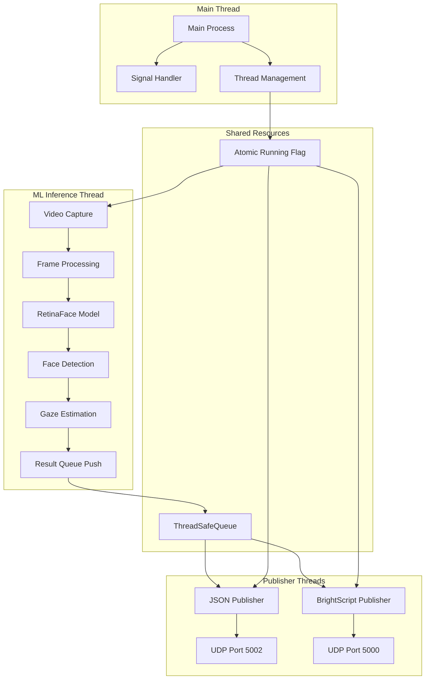
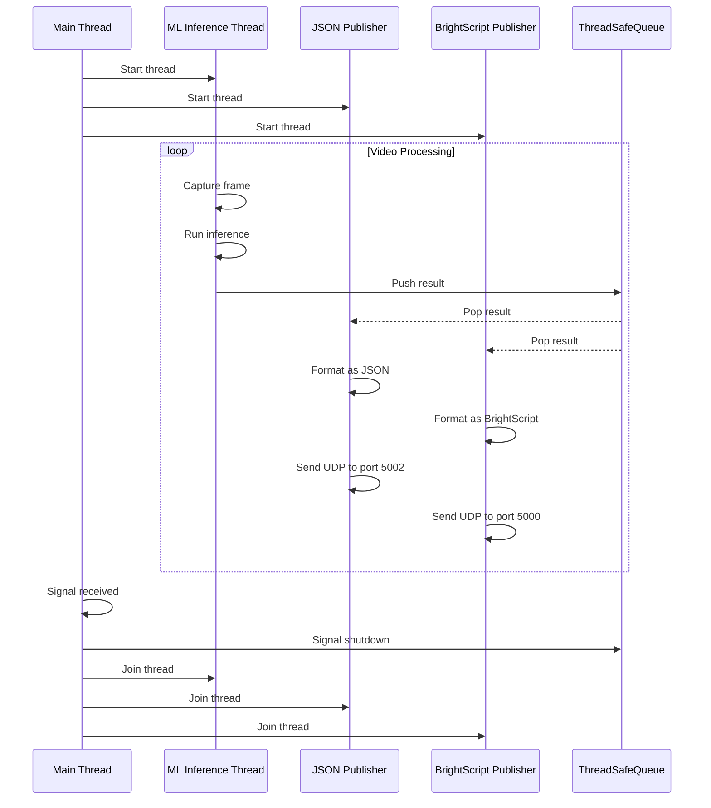
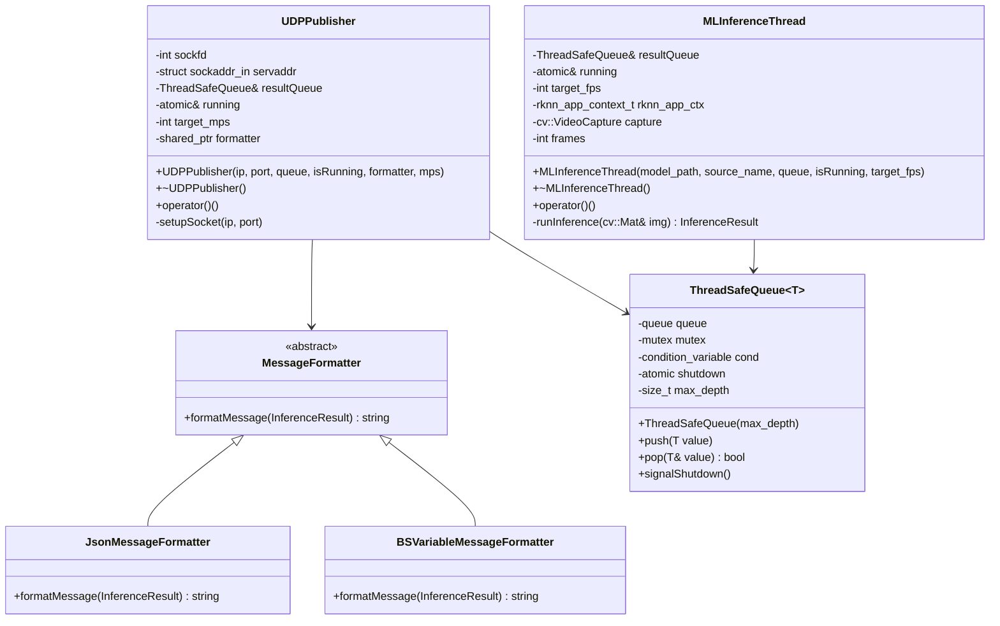
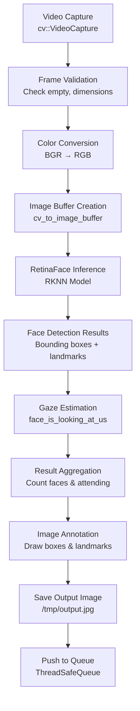
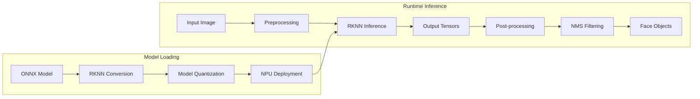
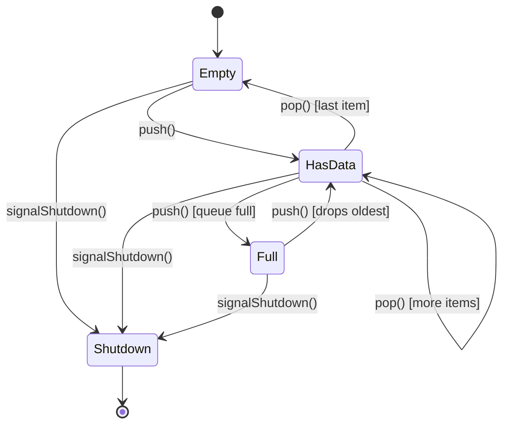
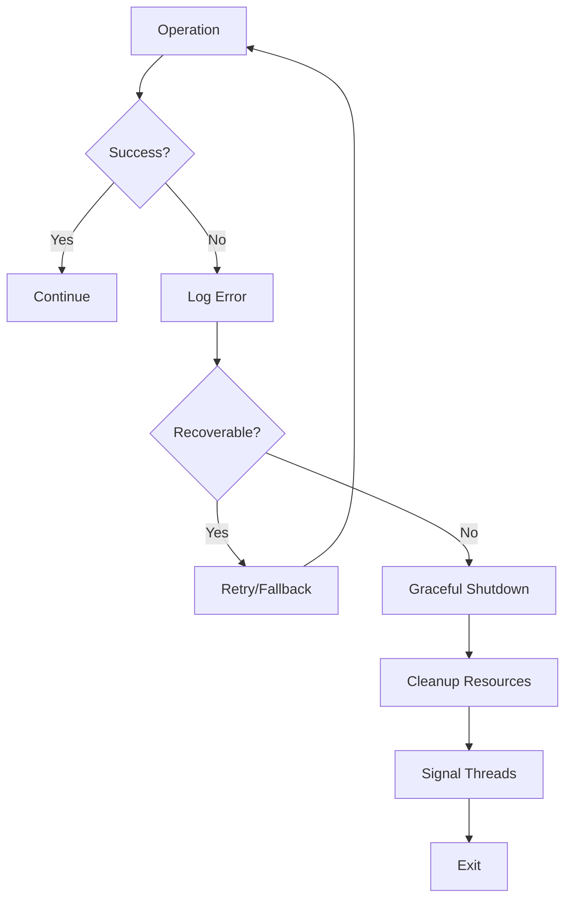
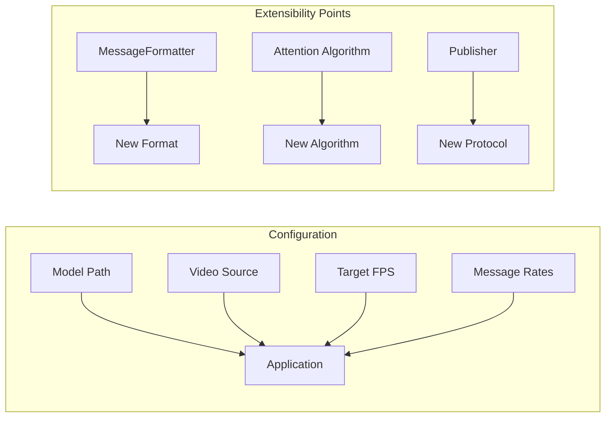
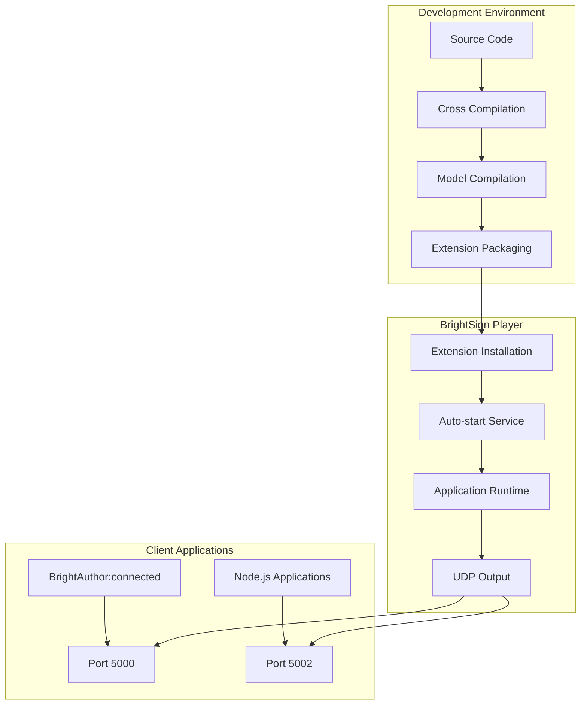

# BrightSign NPU Gaze Detection Extension - Design Document

## Overview

The BrightSign NPU Gaze Detection Extension is a multi-threaded C++ application that performs real-time face detection and gaze estimation using the Rockchip RK3588/RK3568 NPU. The application captures video from USB cameras, processes each frame through a RetinaFace neural network model, determines if detected faces are looking at the camera, and publishes the results via UDP in both JSON and BrightScript variable formats.

## Architecture Overview

The system follows a producer-consumer pattern with three main threads:

1. **ML Inference Thread** - Captures video frames and runs face detection/gaze estimation
2. **JSON UDP Publisher Thread** - Publishes results in JSON format to port 5002
3. **BrightScript UDP Publisher Thread** - Publishes results in BrightScript variable format to port 5000

All threads communicate through a thread-safe queue that holds inference results.



## Core Components

### 1. Threading Model

The application uses a multi-threaded architecture with careful synchronization:

- **Main Thread**: Manages application lifecycle, signal handling, and thread coordination
- **MLInferenceThread**: Produces inference results by processing video frames
- **UDPPublisher Threads** (2 instances): Consume results from the queue and publish via UDP

#### Thread Synchronization



### 2. Data Structures

#### InferenceResult
```cpp
struct InferenceResult {
    int count_all_faces_in_frame;     // Total faces detected
    int num_faces_attending;          // Faces looking at camera
    std::chrono::system_clock::time_point timestamp;
};
```

#### RetinaFace Objects
```cpp
typedef struct retinaface_object_t {
    int cls;                    // Classification (face/background)
    box_rect_t box;            // Bounding box coordinates
    float score;               // Confidence score
    ponit_t ponit[5];          // 5 facial landmarks
} retinaface_object_t;
```

#### Image Buffer
```cpp
typedef struct {
    int width, height;
    int width_stride, height_stride;
    image_format_t format;
    unsigned char* virt_addr;
    int size;
    int fd;
} image_buffer_t;
```

### 3. Class Hierarchy



### 4. ML Inference Pipeline

The ML inference pipeline processes video frames through several stages:



#### Gaze Detection Algorithm

The gaze detection uses geometric analysis of facial features:

```cpp
bool face_is_looking_at_us(retinaface_object_t face) {
    // Calculate interocular distance
    auto left_eye = face.ponit[0];
    auto right_eye = face.ponit[1];
    auto interocular_dist_pix = sqrt(pow(left_eye.x - right_eye.x, 2) + 
                                    pow(left_eye.y - right_eye.y, 2));
    
    // Calculate face dimensions
    auto face_width = face.box.right - face.box.left;
    auto face_height = face.box.bottom - face.box.top;
    
    // Calculate ratios
    float face_aspect_ratio = (float)face_height / (float)face_width;
    float interocular_face_ratio = interocular_dist_pix / face_width;
    
    // Decision thresholds based on research
    return face_aspect_ratio > 1.2 && face_aspect_ratio < 2.0 &&
           interocular_face_ratio > 0.3 && interocular_face_ratio < 0.7;
}
```

**Algorithm Rationale:**
- **Face Aspect Ratio**: Frontal faces have height/width ratio near golden ratio (~1.618)
- **Interocular Distance**: Eye spacing relative to face width indicates head orientation
- **Thresholds**: Based on research from PMC2814183 and ResearchGate publications

### 5. RetinaFace Model Integration

The system uses the RetinaFace neural network through the Rockchip RKNN runtime:



#### Model Context Structure
```cpp
typedef struct {
    rknn_context rknn_ctx;           // RKNN runtime context
    rknn_input_output_num io_num;    // Input/output tensor counts
    rknn_tensor_attr *input_attrs;   // Input tensor attributes
    rknn_tensor_attr *output_attrs;  // Output tensor attributes
    int model_channel;               // Input channels (3 for RGB)
    int model_width;                 // Input width (320)
    int model_height;                // Input height (320)
} rknn_app_context_t;
```

### 6. Thread-Safe Queue Implementation

The queue ensures thread-safe communication between producer and consumers:



**Key Features:**
- **Bounded Queue**: Maximum depth of 1 to prevent memory buildup
- **Condition Variables**: Efficient blocking/waking of consumer threads
- **Graceful Shutdown**: Coordinated shutdown signal for all threads
- **Drop Policy**: Drops oldest items when queue is full

### 7. UDP Publishing System

The system publishes results in two formats to different ports:

#### JSON Format (Port 5002)
```json
{
    "faces_in_frame_total": 2,
    "faces_attending": 1,
    "timestamp": 1746732408
}
```

#### BrightScript Variable Format (Port 5000)
```
faces_attending:1!!faces_in_frame_total:2!!timestamp:1746732408
```

### 8. Error Handling and Robustness

The system includes comprehensive error handling:



**Error Scenarios Handled:**
- Camera connection failures
- Model loading errors
- Frame capture exceptions
- Socket creation failures
- Memory allocation errors
- Thread synchronization issues

### 9. Performance Considerations

#### Frame Rate Control
- Target FPS limiting to prevent resource exhaustion
- Frame timing measurements for performance monitoring
- Adaptive sleep intervals based on processing time

#### Memory Management
- Bounded queue prevents memory leaks
- Automatic OpenCV Mat cleanup
- RKNN context lifecycle management
- Socket resource cleanup

#### Threading Efficiency
- Lock-free atomic operations where possible
- Condition variables for efficient blocking
- Minimal critical sections
- Producer-consumer pattern for load balancing

### 10. Configuration and Extensibility

The system is designed for extensibility:



**Extension Points:**
- **Message Formatters**: Add new output formats by implementing `MessageFormatter` interface
- **Attention Algorithms**: Replace `face_is_looking_at_us` with ML-based approaches
- **Publishers**: Add new communication protocols (TCP, WebSocket, etc.)
- **Models**: Support different face detection models through RKNN interface

## File Structure Analysis

### Source Files
- **`main.cpp`**: Entry point, thread management, signal handling
- **`inference.cpp`**: ML inference thread implementation
- **`publisher.cpp`**: UDP publisher threads and message formatting
- **`attention.cpp`**: Gaze detection algorithm
- **`retinaface.cc`**: RetinaFace model integration and post-processing
- **`queue.cpp`**: Thread-safe queue implementation
- **`image_utils.c`**: Image processing utilities
- **`image_drawing.c`**: Image annotation functions
- **`file_utils.c`**: File I/O utilities
- **`utils.cc`**: General utility functions

### Header Files
- **`inference.h`**: ML inference thread interface
- **`publisher.h`**: Publisher classes and formatters
- **`attention.h`**: Gaze detection interface
- **`retinaface.h`**: RetinaFace model structures
- **`queue.h/.tpp`**: Thread-safe queue template
- **`common.h`**: Common data structures
- **`image_utils.h`**: Image processing interfaces
- **`utils.h`**: Utility function declarations

## Deployment Architecture

The system is packaged as a BrightSign Extension:



## Conclusion

The BrightSign NPU Gaze Detection Extension demonstrates a well-architected, multi-threaded system that efficiently combines computer vision, machine learning, and real-time communication. The design prioritizes performance, reliability, and extensibility while maintaining clean separation of concerns through its modular architecture.

The system successfully leverages the Rockchip NPU for hardware-accelerated inference while providing a flexible framework for future enhancements and integrations.